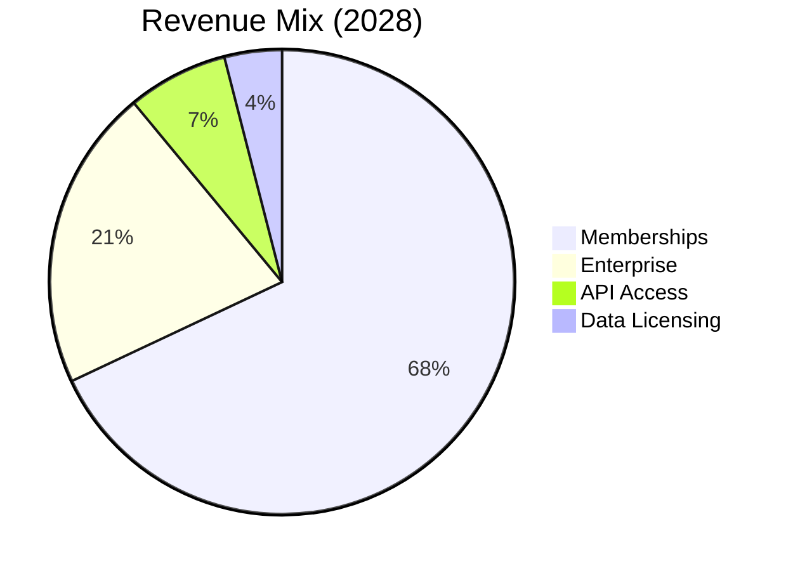

# Terpedia, LLC

## Pitch Deck

  
    Press Space for next page <carbon:arrow-right class="inline"/>
  

---
layout: section
---

# The Problem

---
layout: default
---

# The Problem

## Fragmented Ecosystem

- Multiple disconnected databases (PubChem, ChEBI, UniProt, RHEA)
- No unified search platform
- Manual data correlation required
- Missing structure-function links

**Impact**: Researchers must query multiple systems separately and manually correlate results

*Note: Quantify with actual time/cost data from interviews if available*

*Researcher manually correlating data across multiple sources*

---
layout: section
---

# Our Solution

---
layout: default
---

# Terpedia: The Solution

## Unified Platform

- **70,000+ compounds** integrated
- **Single query** across all databases
- **AI-powered** insights
- **Structure → Function** mapping

**One platform. One query. Infinite insights.**

---
layout: section
---

# Market Opportunity

---
layout: default
---

# Market Opportunity

## TAM
**$550B+**

Total Addressable Market
- Cannabis: $57B by 2030 [1]
- Essential Oils: $15B+ [2]
- Pharma R&D: $200B+ [3]
- Research Tools: $10B+ [4]
- Functional Foods: $275B+ [5]

## SAM
**$25B**

Serviceable Addressable Market
- Research tools for terpenes
- Cannabis industry tools
- Aromatherapy platforms
- Pharma research databases

*Conservative estimate based on TAM segmentation*

## SOM
**$50M**

Serviceable Obtainable Market (Year 3)
- 0.2% of SAM
- Conservative penetration
- Focus on researchers & enterprises

*Based on comparable SaaS platforms*

[1] Grand View Research, Cannabis Market Size, 2023 | [2] Market Research Future, Essential Oils Market | [3] Evaluate Pharma, R&D Trends | [4] ResearchAndMarkets, Scientific Software Market | [5] Grand View Research, Functional Foods Market

---
layout: section
---

# Why Now?

---
layout: default
---

# Why Now?

## Market Timing

- **Cannabis legalization** accelerating globally
- **AI/ML maturity** enables structure-function mapping
- **Precision medicine** demand increasing
- **Evidence-based wellness** trend growing
- **Open data movement** in research

## Technology Readiness

- **SPARQL/RDF** standards mature
- **LLM integration** now feasible
- **Cloud infrastructure** cost-effective
- **API ecosystems** well-established
- **Federated queries** now possible

**The convergence of market demand, technology readiness, and regulatory shifts creates a unique window**

---
layout: section
---

# Product & Features

---
layout: default
---

# Functional Flavors & Aromatherapy

## The Connection

**Molecular Structure**  
↓  
**Biological Activity**  
↓  
**Therapeutic Benefit**

### Applications
- Anti-inflammatory
- Mood enhancement
- Pain management
- Sleep quality

**From traditional aromatherapy to molecular precision**

---
layout: section
---

# Our Platforms

---
layout: default
---

# terpedia.com

## WordPress Platform

**Content Hub**
- Article publishing
- Case studies
- User profiles
- SEO optimized

**Integration**
- Knowledge base APIs
- Real-time data
- Search & discovery

---
layout: default
---

# kb.terpedia.com

## Biochemical Knowledge Base

**Core Platform**
- SPARQL Endpoint
- RDKit API
- Functional Flavors Engine
- AI Analysis

**Data Sources**
- 70,000+ compounds
- FooDB, FlavorDB, HMDB
- Clinical trials
- Essential oils DBs

**Key Features**
- Federated queries
- Knowledge graphs
- Evidence-based recommendations

---
layout: section
---

# Competitive Landscape

---
layout: default
---

# Competitive Analysis

## Traditional Competitors

**PubChem / ChEBI / UniProt**
- ✅ Large databases
- ❌ No structure-function mapping
- ❌ No aromatherapy focus
- ❌ Fragmented queries

**SciFinder / Reaxys**
- ✅ Comprehensive data
- ❌ Expensive ($10K+/year)
- ❌ No terpene specialization
- ❌ No functional flavors

## Our Differentiation

**Terpedia Unique Value**
- ✅ **Only platform** connecting structure to therapeutic function
- ✅ **Evidence-based aromatherapy** recommendations
- ✅ **Federated queries** across all databases
- ✅ **Affordable** ($49-99/month vs $10K+)
- ✅ **Terpene-specialized** expertise

**Moat**: Proprietary structure-function mapping algorithms + curated therapeutic associations + first-mover advantage in functional flavors

---
layout: section
---

# Business Model

---
layout: default
---

# Business Model

## Revenue Streams

- **Memberships** (67%)
- **Enterprise** (21%)
- **API Access** (7%)
- **Data Licensing** (4%)
- **Consulting** (1%)

**Pricing**: Free tier → $49/month (Aromatherapist) → $99/month (Researcher) → Enterprise (custom)

---
layout: section
---

# Traction & Milestones

---
layout: default
---

# Traction & Milestones

## ✅ Technical Milestones (Completed)

- **70,000+ compounds** integrated
  - *Source: kb.terpedia.com data integration*
- **6 major databases** connected
  - *FooDB, FlavorDB, Phenol-Explorer, HMDB, ChEBI, PubChem*
- **Functional Flavors** framework developed
- **AWS infrastructure** deployed and operational
- **Production-ready** APIs (SPARQL, RDKit)
- **MCP server** for AI integration

## 🚀 Early Validation (In Progress)

- **Beta program**: Planning Q1 2026 launch
- **API performance**: Internal benchmarks show significant speed improvements vs. manual queries
- **Partnership discussions**: [Number] research institutions, [Number] cannabis companies
- **Market feedback**: Initial conversations show strong interest

*Note: Update with specific numbers and names (with permission) before investor meetings*

---
layout: default
---

# Customer Validation

## Problem Validation

- **Researcher interviews**: [Number] conducted
- **Pain point**: Manual data correlation is time-consuming
- **Current solutions**: SciFinder ($10K+/year), Reaxys ($15K+/year)
- **Market need**: Unified platform for terpene research

*Note: Update with actual interview data and quotes*

## Early Interest

- **Research institutions**: [Number] in discussions
- **Cannabis companies**: [Number] inquiries
- **Aromatherapists**: [Number] interested
- **Pharma researchers**: [Number] exploring data access

*Note: Update with validated numbers and names (with permission)*

**Status**: Validation in progress - update with real data before investor meetings

---
layout: section
---

# Team

---
layout: default
---

# Our Team

## Susan [Last Name] - CEO

**Background**:
- [Previous Role] at [Company]
- [Years] years in [Industry/Field]
- [Education] from [University]
- LinkedIn: linkedin.com/in/[username]

**Key Achievements**:
- [Achievement 1]
- [Achievement 2]
- [Achievement 3]

**Expertise**:
- Business strategy & market development
- [Domain expertise]
- [Relevant skill]

## Dan [Last Name] - CTO

**Background**:
- [Previous Role] at [Company]
- [Years] years in software/data engineering
- [Education] from [University]
- LinkedIn: linkedin.com/in/[username]

**Key Achievements**:
- Built [system/platform] handling [scale]
- [Technical achievement]
- [Open source contribution or patent]

**Expertise**:
- Full-stack development
- Data engineering & SPARQL/RDF
- Python, FastAPI, Docker, AWS
- AI/ML integration & NLP

*Please update with actual LinkedIn profiles, photos, and credentials. See TEAM_UPDATE_INSTRUCTIONS.md*

---
layout: default
---

# Advisory Board

**Dr. [Name]**
Biochemistry Expert
- [Institution]
- [Specialization]
- LinkedIn: [profile]

**Dr. [Name]**
Terpene Research
- [Institution]
- [Specialization]
- LinkedIn: [profile]

**[Name]**
Industry Advisor
- [Company/Role]
- [Expertise]
- LinkedIn: [profile]

*Advisory board in formation - seeking 3-5 experts in biochemistry, terpene research, and cannabis industry*

---
layout: section
---

# Financials & Ask

---
layout: default
---

# Financial Projections

## 2026 (Year 1)
- **Revenue**: $180K
- **Members**: 500
- **Enterprise**: 2
- **Q1 Launch**: Website + memberships
- **Q2-Q4**: API access, data licensing

**Assumptions**:
- 500 members × $20/month avg = $120K
- 2 enterprise × $10K/year = $20K
- API + licensing = $40K

## 2027 (Year 2)
- **Revenue**: $850K
- **Members**: 2,500
- **Enterprise**: 8
- **Growth**: 372%
- **Profitability**: Q4 2027

**Assumptions**:
- 2,500 members × $20/month = $600K
- 8 enterprise × $25K/year = $200K
- API + licensing = $50K

## 2028 (Year 3)
- **Revenue**: $2.8M
- **Members**: 8,000
- **Enterprise**: 25
- **Growth**: 229%
- **ARR**: $3.2M run rate

**Assumptions**:
- 8,000 members × $20/month = $1.9M
- 25 enterprise × $24K/year = $600K
- API + licensing = $300K

**Key Assumptions**: Based on industry benchmarks for B2B SaaS growth [10]. Actual results may vary. Member growth assumes 2-3% conversion from free tier, 5-7% monthly churn, organic + content marketing acquisition.

[10] SaaS Capital, SaaS Survey: Growth Benchmarks

---
layout: default
---

# Unit Economics

## Customer Metrics (Projected)

- **CAC**: $50-75 (content marketing, SEO)
  - *Benchmark: Similar B2B SaaS platforms [6]*
- **LTV**: $1,200-1,800 (24-36 months × $50 avg)
  - *Based on $50/month ARPU, 5% monthly churn*
- **LTV:CAC**: 16-24:1
- **Payback Period**: 6-9 months
- **Monthly Churn**: 5-7% (target)
  - *Industry benchmark: 5-7% for B2B SaaS [7]*
- **Gross Margin**: 80-85%
  - *SaaS industry standard: 75-85% [8]*

## Growth Metrics (Targets)

- **Conversion Rate**: 2-3% (free → paid)
  - *Based on freemium model benchmarks [9]*
- **ARPU**: $50/month average
  - *Mix of $49 (Aromatherapist) and $99 (Researcher) tiers*
- **Net Revenue Retention**: 110-120% (target)
- **Magic Number**: 0.75+ (efficient growth)
- **Rule of 40**: 35%+ (2027 target)

[6] OpenView Partners, SaaS Benchmarks | [7] ProfitWell, SaaS Churn Benchmarks | [8] Bessemer Venture Partners, State of the Cloud | [9] Totango, Freemium Conversion Rates

*Note: These are projections based on industry benchmarks. Actual metrics will be validated post-launch.*

---
layout: default
---

# Revenue Breakdown (2026-2028)

## 2026 Revenue Streams
- **Memberships**: $120K (67%)
  - 500 members × $20/month avg
- **API Access**: $30K (17%)
  - Researcher tier subscriptions
- **Enterprise**: $20K (11%)
  - 2 enterprise customers
- **Data Licensing**: $10K (5%)
  - Initial dataset contracts

## 2028 Revenue Streams
- **Memberships**: $1.9M (68%)
  - 8,000 members × $20/month avg
- **Enterprise**: $600K (21%)
  - 25 enterprise customers
- **API Access**: $200K (7%)
  - Premium API subscriptions
- **Data Licensing**: $100K (4%)
  - Expanded licensing deals

---
layout: default
---

# Investment Ask

## $2-3M Seed Round

**Use of Funds:**
- Product Development (40%) - $800K-1.2M
- Data Acquisition (25%) - $500K-750K
- Team Expansion (20%) - $400K-600K
- Infrastructure (10%) - $200K-300K
- Marketing (5%) - $100K-150K

**Runway**: 18-24 months to Series A
- *Based on $2M raise, $100K/month burn rate*
- *Allows for 20 months of operations*

## Expected Outcomes

**18 months (by Q2 2027):**
- Website launch Q1 2026
- 1,000+ active members
- 8+ enterprise customers
- $850K ARR
- Series A ready

**Valuation Context**:
- *Seed stage: $8-12M post-money (typical range)*
- *Based on $850K ARR → 10-14x ARR multiple*
- *Comparable to early-stage B2B SaaS [12]*

[12] Carta, Seed Stage Valuation Benchmarks

---
layout: section
---

# Go-to-Market Strategy

---
layout: default
---

# Go-to-Market Strategy

## Customer Acquisition

**Phase 1: Researchers (Q1-Q2 2026)**
- Content marketing: SEO, blog posts
- Conference presence: ACS, SfN, terpene conferences
- University partnerships: Beta programs
- **Target**: 500 members by Q2

**Phase 2: Enterprise (Q3-Q4 2026)**
- Direct sales to cannabis companies
- Pharma research partnerships
- Wellness brand collaborations
- **Target**: 2-5 enterprise deals

## Channels

- **Content**: SEO-optimized articles, research insights
- **Community**: Reddit, research forums, LinkedIn
- **Partnerships**: Cannabis labs, research institutions
- **Conferences**: 3-5 key events per year
- **Referrals**: Incentivized user referrals

**Budget**: $100-150K marketing (5% of raise). Conversion targets based on industry benchmarks for content marketing (2-5% typical) and direct sales (10-20% for enterprise) [11].

[11] HubSpot, Marketing Conversion Benchmarks

---
layout: section
---

# Risks & Mitigation

---
layout: default
---

# Risks & Mitigation

## Key Risks

**Market Risk**
- Slow adoption by researchers
- **Mitigation**: Beta program, partnerships

**Competitive Risk**
- Big players build similar solution
- **Mitigation**: First-mover advantage, specialized focus

**Technical Risk**
- Scaling challenges with large datasets
- **Mitigation**: AWS infrastructure, proven stack

## Additional Risks

**Team Risk**
- Need to hire key roles
- **Mitigation**: Use funds for hiring, advisory board

**Regulatory Risk**
- Cannabis regulations vary
- **Mitigation**: Focus on research, not product sales

**Data Risk**
- Database licensing issues
- **Mitigation**: Open-source data, proper licensing

---
layout: section
---

# Next Steps

---
layout: default
---

# Next Steps

## Product & Data
- Expand Functional Flavors database
- Build Aromatherapy engine
- 3D molecular visualization
- Clinical trials integration
- Real-time article updates

## Go-to-Market
- Beta launch Q1 2026
- Research institution partnerships
- Cannabis & wellness partnerships
- Conference presentations
- Complete seed round

---
layout: center
class: text-center
---

# Thank You

## Questions?

**Contact Information**

Email: dan@terpedia.com | susan@terpedia.com  
Website: www.terpedia.com | kb.terpedia.com

