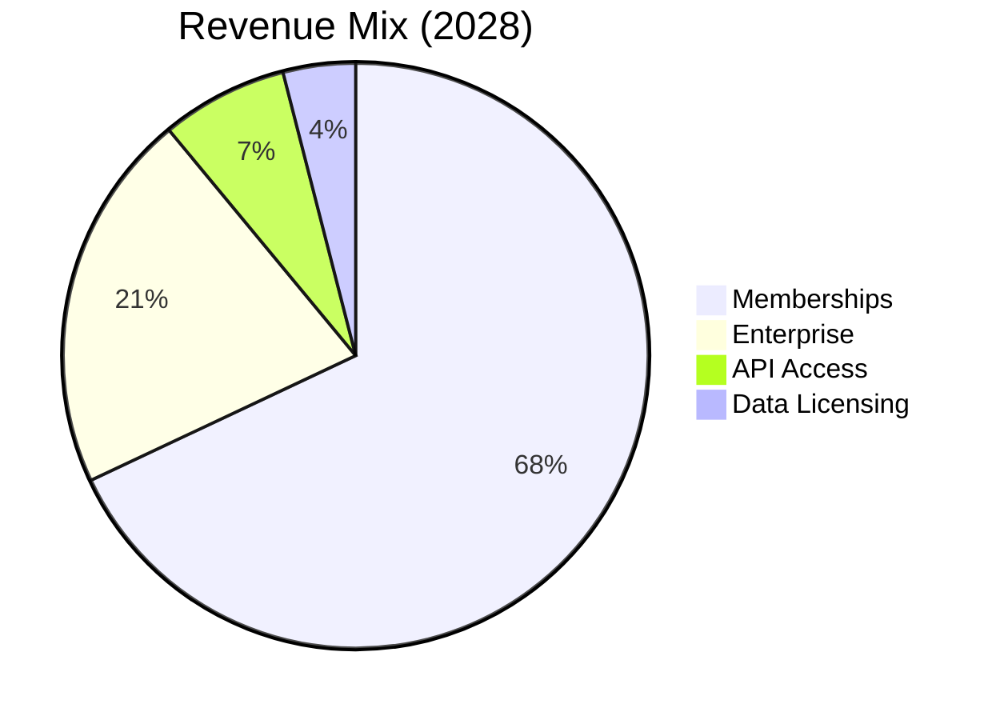

# Terpedia, LLC

## Pitch Deck

  
    Press Space for next page <carbon:arrow-right class="inline"/>
  

---
layout: section
---

# The Problem

---
layout: default
---

# The Problem

## Fragmented Ecosystem

- Multiple disconnected databases
- No unified search platform
- Manual data correlation
- Missing structure-function links

**Result**: Hours wasted manually connecting terpene structures to therapeutic effects

*Researcher manually correlating data across multiple sources*

---
layout: section
---

# Our Solution

---
layout: default
---

# Terpedia: The Solution

## Unified Platform

- **70,000+ compounds** integrated
- **Single query** across all databases
- **AI-powered** insights
- **Structure → Function** mapping

**One platform. One query. Infinite insights.**

---
layout: section
---

# Market Opportunity

---
layout: default
---

# Market Opportunity

## Market Size

- **Cannabis Market**: $57B by 2030
- **Essential Oils**: $15B+ market
- **Aromatherapy**: $4.2B market, 8.5% CAGR
- **Functional Foods**: $275B+ market
- **Pharmaceutical R&D**: $200B+ industry
- **Research Tools**: $10B+ market

## Growth Drivers

- Cannabis legalization expanding globally
- Natural product research increasing
- Functional flavors trend in food & beverage
- Evidence-based aromatherapy demand
- AI/ML adoption in drug discovery
- Precision medicine demand
- Terpene therapeutic research growth

---
layout: section
---

# Product & Features

---
layout: default
---

# Functional Flavors & Aromatherapy

## The Connection

**Molecular Structure**  
↓  
**Biological Activity**  
↓  
**Therapeutic Benefit**

### Applications
- Anti-inflammatory
- Mood enhancement
- Pain management
- Sleep quality

**From traditional aromatherapy to molecular precision**

---
layout: section
---

# Our Platforms

---
layout: default
---

# terpedia.com

## WordPress Platform

**Content Hub**
- Article publishing
- Case studies
- User profiles
- SEO optimized

**Integration**
- Knowledge base APIs
- Real-time data
- Search & discovery

---
layout: default
---

# kb.terpedia.com

## Biochemical Knowledge Base

**Core Platform**
- SPARQL Endpoint
- RDKit API
- Functional Flavors Engine
- AI Analysis

**Data Sources**
- 70,000+ compounds
- FooDB, FlavorDB, HMDB
- Clinical trials
- Essential oils DBs

**Key Features**
- Federated queries
- Knowledge graphs
- Evidence-based recommendations

---
layout: section
---

# Business Model

---
layout: default
---

# Business Model

## Revenue Streams

- **Memberships** (67%)
- **Enterprise** (21%)
- **API Access** (7%)
- **Data Licensing** (4%)
- **Consulting** (1%)

**Pricing**: Free tier → $49/month (Aromatherapist) → $99/month (Researcher) → Enterprise (custom)

---
layout: section
---

# Traction & Milestones

---
layout: default
---

# Traction & Milestones

## ✅ Completed

- **70,000+ compounds** integrated
- **6 major databases** connected
- **Functional Flavors** framework
- **AWS infrastructure** deployed
- **Production-ready** APIs
- **MCP server** for AI

---
layout: section
---

# Team

---
layout: default
---

# Our Team

## Leadership

- **CEO**: Susan
- **CTO**: Dan
- **Scientific Advisors**: Biochemistry experts

## Expertise

- **Biochemical Knowledge**: Deep terpene research background
- **Technical Stack**: SPARQL, RDF, Python, FastAPI, Docker
- **Data Engineering**: Large-scale database integration
- **AI/ML**: LLM integration, NLP, knowledge graphs

---
layout: section
---

# Financials & Ask

---
layout: default
---

# Financial Projections

## 2026 (Year 1)
- **Revenue**: $180K
- **Members**: 500
- **Enterprise**: 2
- **Q1 Launch**: Website + memberships
- **Q2-Q4**: API access, data licensing

## 2027 (Year 2)
- **Revenue**: $850K
- **Members**: 2,500
- **Enterprise**: 8
- **Growth**: 372%
- **Profitability**: Q4 2027

## 2028 (Year 3)
- **Revenue**: $2.8M
- **Members**: 8,000
- **Enterprise**: 25
- **Growth**: 229%
- **ARR**: $3.2M run rate

---
layout: default
---

# Revenue Breakdown (2026-2028)

## 2026 Revenue Streams
- **Memberships**: $120K (67%)
  - 500 members × $20/month avg
- **API Access**: $30K (17%)
  - Researcher tier subscriptions
- **Enterprise**: $20K (11%)
  - 2 enterprise customers
- **Data Licensing**: $10K (5%)
  - Initial dataset contracts

## 2028 Revenue Streams
- **Memberships**: $1.9M (68%)
  - 8,000 members × $20/month avg
- **Enterprise**: $600K (21%)
  - 25 enterprise customers
- **API Access**: $200K (7%)
  - Premium API subscriptions
- **Data Licensing**: $100K (4%)
  - Expanded licensing deals

---
layout: default
---

# Investment Ask

## $2-3M Seed Round

**Use of Funds:**
- Product Development (40%)
- Data Acquisition (25%)
- Team Expansion (20%)
- Infrastructure (10%)
- Marketing (5%)

## Expected Outcomes

**18 months (by Q2 2027):**
- Website launch Q1 2026
- 1,000+ active members
- 8+ enterprise customers
- $850K ARR
- Series A ready

---
layout: section
---

# Next Steps

---
layout: default
---

# Next Steps

## Product & Data
- Expand Functional Flavors database
- Build Aromatherapy engine
- 3D molecular visualization
- Clinical trials integration
- Real-time article updates

## Go-to-Market
- Beta launch Q1 2026
- Research institution partnerships
- Cannabis & wellness partnerships
- Conference presentations
- Complete seed round

---
layout: center
class: text-center
---

# Thank You

## Questions?

**Contact Information**

Email: dan@terpedia.com | susan@terpedia.com  
Website: www.terpedia.com | kb.terpedia.com

