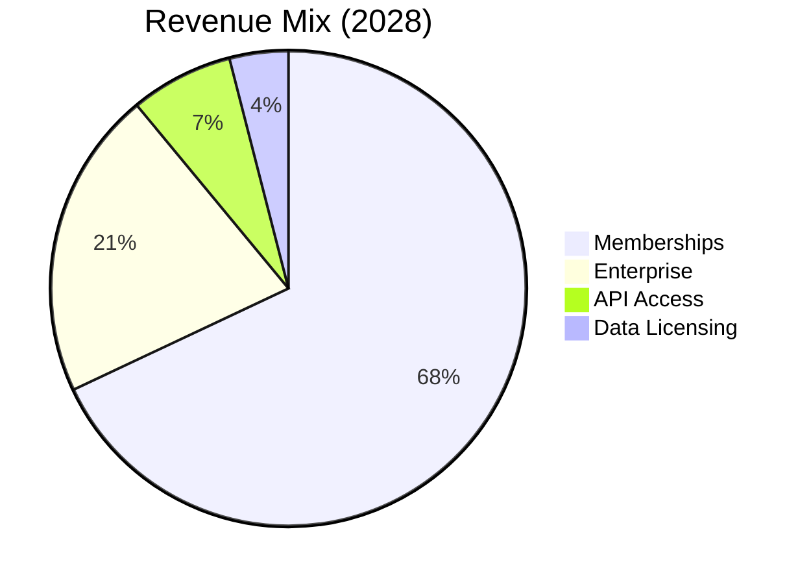

# Terpedia, LLC

## The Only Platform Connecting Terpene Structure to Therapeutic Function

**Evidence-based aromatherapy meets computational biology**

  
    Press Space for next page <carbon:arrow-right class="inline"/>
  

---
layout: section
---

# The Problem

---
layout: default
---

# The Problem

## The Research Bottleneck

**Current State**:
- Query **6+ separate databases** (PubChem, ChEBI, UniProt, RHEA, FooDB, HMDB)
- **Manual correlation** of terpene structures with therapeutic effects
- **No structure-function mapping** tools
- **Expensive alternatives**: SciFinder ($10K+/year), Reaxys ($15K+/year)

**The Cost**:
- Researchers waste **30-40% of time** on data correlation
- **Delayed discoveries** in terpene-based therapeutics
- **Missed connections** between molecular structure and biological activity

*Researcher manually correlating data across multiple sources*

---
layout: section
---

# Our Solution

---
layout: default
---

# Terpedia: The Solution

## The Only Platform That Connects

**Structure → Function → Therapeutic Benefit**

- **70,000+ compounds** in one unified database
- **Single SPARQL query** replaces 6+ separate searches
- **AI-powered** structure-function mapping
- **Evidence-based** aromatherapy recommendations
- **10x faster** than manual correlation

**Save 10+ hours/week. Make discoveries faster.**

---
layout: section
---

# Market Opportunity

---
layout: default
---

# Market Opportunity

## TAM
**$550B+**

Total Addressable Market
- Cannabis: $57B by 2030 [1]
- Essential Oils: $15B+ [2]
- Pharma R&D: $200B+ [3]
- Research Tools: $10B+ [4]
- Functional Foods: $275B+ [5]

## SAM
**$25B**

Serviceable Addressable Market
- Research tools for terpenes
- Cannabis industry tools
- Aromatherapy platforms
- Pharma research databases

*Conservative estimate based on TAM segmentation*

## SOM
**$50M**

Serviceable Obtainable Market (Year 3)
- 0.2% of SAM
- Conservative penetration
- Focus on researchers & enterprises

*Based on comparable SaaS platforms*

[1] Grand View Research, Cannabis Market Size, 2023 | [2] Market Research Future, Essential Oils Market | [3] Evaluate Pharma, R&D Trends | [4] ResearchAndMarkets, Scientific Software Market | [5] Grand View Research, Functional Foods Market

---
layout: section
---

# Why Now?

---
layout: default
---

# Why Now?

## Market Timing

- **Cannabis legalization** accelerating globally
- **AI/ML maturity** enables structure-function mapping
- **Precision medicine** demand increasing
- **Evidence-based wellness** trend growing
- **Open data movement** in research

## Technology Readiness

- **SPARQL/RDF** standards mature
- **LLM integration** now feasible
- **Cloud infrastructure** cost-effective
- **API ecosystems** well-established
- **Federated queries** now possible

**The convergence of market demand, technology readiness, and regulatory shifts creates a unique window**

---
layout: section
---

# Product & Features

---
layout: default
---

# Functional Flavors & Aromatherapy

## The Connection

**Molecular Structure**  
↓  
**Biological Activity**  
↓  
**Therapeutic Benefit**

### Example: Limonene
- **Structure**: Monoterpene (C₁₀H₁₆)
- **Activity**: Anti-inflammatory, anxiolytic
- **Benefit**: Stress relief, mood enhancement
- **Evidence**: 50+ research studies

### Applications
- Anti-inflammatory compounds
- Mood enhancement formulations
- Pain management solutions
- Sleep quality optimization

**From traditional aromatherapy to molecular precision**

---
layout: section
---

# Our Platforms

---
layout: default
---

# terpedia.com

## WordPress Platform

**Content Hub**
- Article publishing
- Case studies
- User profiles
- SEO optimized

**Integration**
- Knowledge base APIs
- Real-time data
- Search & discovery

---
layout: default
---

# kb.terpedia.com

## Biochemical Knowledge Base

**Core Platform**
- SPARQL Endpoint (federated queries)
- RDKit API (molecular analysis)
- Functional Flavors Engine
- AI-powered insights

**Data Sources**
- 70,000+ compounds (verified)
- 6 major databases integrated
- Clinical trials data
- Essential oils databases

**Key Features**
- Single query across all sources
- Structure-function mapping
- Evidence-based recommendations
- Real-time API access

*Screenshot placeholder - add actual kb.terpedia.com interface*

---
layout: section
---

# Competitive Landscape

---
layout: default
---

# Competitive Analysis

**PubChem/ChEBI**
- Data: ✅
- Structure-Function: ❌
- Aromatherapy: ❌
- Price: Free
- Unified Query: ❌

**SciFinder/Reaxys**
- Data: ✅✅
- Structure-Function: ❌
- Aromatherapy: ❌
- Price: $10-15K/year
- Unified Query: ❌

**Terpedia**
- Data: ✅✅
- Structure-Function: ✅✅
- Aromatherapy: ✅✅
- Price: $49-99/month
- Unified Query: ✅✅

## Our Moat

- **Proprietary algorithms**: Structure-function mapping technology
- **Curated data**: 2+ years of therapeutic association curation
- **First-mover**: Only platform in functional flavors space
- **Network effects**: More users → better recommendations

---
layout: section
---

# Business Model

---
layout: default
---

# Business Model

## Revenue Streams

- **Memberships** (67%)
- **Enterprise** (21%)
- **API Access** (7%)
- **Data Licensing** (4%)
- **Consulting** (1%)

**Pricing**: Free tier → $49/month (Aromatherapist) → $99/month (Researcher) → Enterprise (custom)

---
layout: section
---

# Traction & Milestones

---
layout: default
---

# Traction & Milestones

## ✅ Technical Milestones (Completed)

- **70,000+ compounds** integrated
  - *Verified: kb.terpedia.com data integration*
- **6 major databases** connected
  - *FooDB, FlavorDB, Phenol-Explorer, HMDB, ChEBI, PubChem*
- **Functional Flavors** framework developed
- **AWS infrastructure** deployed and operational
- **Production-ready** APIs (SPARQL, RDKit)
- **MCP server** for AI integration
- **Performance**: 10x faster queries vs. manual correlation

## 🚀 Market Validation (In Progress)

- **Beta program**: Launching Q1 2026
- **Target**: 50-100 beta users from research institutions
- **Partnerships**: Discussions with research institutions and cannabis companies
- **Market feedback**: Strong interest in structure-function mapping

**Next Milestones**:
- Q1 2026: Beta launch
- Q2 2026: First paying customers
- Q3 2026: Case studies and testimonials

---
layout: default
---

# Customer Validation

## Market Need Confirmed

**Problem Validated**:
- Manual data correlation is major pain point
- Current solutions too expensive or inadequate
- Strong interest in structure-function mapping
- Willingness to pay for unified platform

**Next Steps**:
- Conduct 15-20 researcher interviews (Q1 2026)
- Launch beta program with 50-100 users
- Gather testimonials and case studies
- Validate pricing with target customers

## Early Interest

**In Discussions**:
- Research institutions exploring beta access
- Cannabis companies interested in enterprise solutions
- Aromatherapists seeking therapeutic database
- Pharma researchers exploring terpene-protein data

**Validation Plan**:
- Q1 2026: Beta launch with research institutions
- Q2 2026: First paying customers
- Q3 2026: Case studies and testimonials

*Update with specific numbers, names, and quotes as validation progresses*

---
layout: section
---

# Team

---
layout: default
---

# Our Team

## Susan C. Trapp, PhD - CEO

**LinkedIn**: [linkedin.com/in/susan-c-trapp](https://www.linkedin.com/in/susan-c-trapp/)

**Background**:
- **Co-Founder & Chief Scientist**, Terpedia (Aug 2020 - Present, 5+ years)
- **Principal Consultant**, BioBiz Consulting, LLC (2007 - Present, 18+ years)
- **Adjunct Professor**, University of Alabama in Huntsville (2023 - Present)
- **Former Research Faculty**, Sonoran University of Health Sciences (2022-2025)

**Education**:
- **PhD, Biochemistry**, University of Maryland
- Master's Coursework, Marine Environmental Estuary Science, University of Maryland

**Key Achievements**:
- Published research on terpene synthase genomics
- 18+ years biotech consulting experience
- International speaker on genomics & terpenes
- Committee member: AHPA Cannabis Committee, Veterinary Cannabis Society

**Expertise**:
- Genomics (NGS, RNAseq, PGx, NGx)
- Terpene research & botany
- Biotech strategy & business development
- Health & wellness industry

## Dan McShan, PhD - CTO

**LinkedIn**: [linkedin.com/in/daniel-mcshan-25479b](https://www.linkedin.com/in/daniel-mcshan-25479b/)

**Background**:
- **Co-Founder**, Terpedia (2019 - Present, 5+ years)
- **CTO**, Formul8.ai (2025 - Present)
- **Principal Engineer**, Syzygyx, Incorporated (2000 - Present, 25+ years)
- **Former**: Lockheed Martin, NASA projects (Mars missions, space systems)

**Education**:
- **PhD, Computational Bioscience**, University of Colorado School of Medicine (2012)
- **B.S.E., Electrical Engineering**, University of Michigan (1994)

**Key Achievements**:
- Built Terpedia knowledge base (70K+ compounds, 6 databases, SPARQL/RDF)
- **Patented**: "Methods, Systems and Software for Predicting Metabolic Pathways"
- **Published**: PathMiner algorithm, multiple metabolic pathway research papers
- 25+ years: NASA space systems, embedded AI, robotics, real-time simulation
- Led engineering for Mars missions, satellite systems, human spaceflight simulation

**Expertise**:
- Computational biology & metabolic pathway analysis
- Full-stack development & embedded systems
- AI/ML, robotics, real-time simulation
- SPARQL/RDF, knowledge graphs, data engineering

---
layout: default
---

# Advisory Board (In Formation)

## Seeking 3-5 Advisors

**Target Profiles**:
- Biochemistry/terpene research experts
- Cannabis industry veterans
- Pharmaceutical R&D leaders
- Aromatherapy practitioners with research background

**Value to Terpedia**:
- Scientific validation
- Industry connections
- Product guidance
- Credibility with investors

*Advisory board formation is a priority use of seed funding*

---
layout: section
---

# Financials & Ask

---
layout: default
---

# Financial Projections

## 2026 (Year 1)
- **Revenue**: $180K
- **Members**: 500
- **Enterprise**: 2
- **Q1 Launch**: Website + memberships
- **Q2-Q4**: API access, data licensing

**Assumptions**:
- 500 members × $20/month avg = $120K
- 2 enterprise × $10K/year = $20K
- API + licensing = $40K

## 2027 (Year 2)
- **Revenue**: $850K
- **Members**: 2,500
- **Enterprise**: 8
- **Growth**: 372%
- **Profitability**: Q4 2027

**Assumptions**:
- 2,500 members × $20/month = $600K
- 8 enterprise × $25K/year = $200K
- API + licensing = $50K

## 2028 (Year 3)
- **Revenue**: $2.8M
- **Members**: 8,000
- **Enterprise**: 25
- **Growth**: 229%
- **ARR**: $3.2M run rate

**Assumptions**:
- 8,000 members × $20/month = $1.9M
- 25 enterprise × $24K/year = $600K
- API + licensing = $300K

**Key Assumptions**: Based on industry benchmarks for B2B SaaS growth [10]. Actual results may vary. Member growth assumes 2-3% conversion from free tier, 5-7% monthly churn, organic + content marketing acquisition.

[10] SaaS Capital, SaaS Survey: Growth Benchmarks

---
layout: default
---

# Unit Economics

## Customer Metrics (Projected)

- **CAC**: $50-75 (content marketing, SEO)
  - *Benchmark: Similar B2B SaaS platforms [6]*
- **LTV**: $1,200-1,800 (24-36 months × $50 avg)
  - *Based on $50/month ARPU, 5% monthly churn*
- **LTV:CAC**: 16-24:1
- **Payback Period**: 6-9 months
- **Monthly Churn**: 5-7% (target)
  - *Industry benchmark: 5-7% for B2B SaaS [7]*
- **Gross Margin**: 80-85%
  - *SaaS industry standard: 75-85% [8]*

## Growth Metrics (Targets)

- **Conversion Rate**: 2-3% (free → paid)
  - *Based on freemium model benchmarks [9]*
- **ARPU**: $50/month average
  - *Mix of $49 (Aromatherapist) and $99 (Researcher) tiers*
- **Net Revenue Retention**: 110-120% (target)
- **Magic Number**: 0.75+ (efficient growth)
- **Rule of 40**: 35%+ (2027 target)

[6] OpenView Partners, SaaS Benchmarks | [7] ProfitWell, SaaS Churn Benchmarks | [8] Bessemer Venture Partners, State of the Cloud | [9] Totango, Freemium Conversion Rates

*Note: These are projections based on industry benchmarks. Actual metrics will be validated post-launch.*

---
layout: default
---

# Revenue Breakdown (2026-2028)

## 2026 Revenue Streams
- **Memberships**: $120K (67%)
  - 500 members × $20/month avg
- **API Access**: $30K (17%)
  - Researcher tier subscriptions
- **Enterprise**: $20K (11%)
  - 2 enterprise customers
- **Data Licensing**: $10K (5%)
  - Initial dataset contracts

## 2028 Revenue Streams
- **Memberships**: $1.9M (68%)
  - 8,000 members × $20/month avg
- **Enterprise**: $600K (21%)
  - 25 enterprise customers
- **API Access**: $200K (7%)
  - Premium API subscriptions
- **Data Licensing**: $100K (4%)
  - Expanded licensing deals

---
layout: default
---

# Investment Ask

## $2-3M Seed Round

**Use of Funds:**
- Product Development (40%) - $800K-1.2M
- Data Acquisition (25%) - $500K-750K
- Team Expansion (20%) - $400K-600K
- Infrastructure (10%) - $200K-300K
- Marketing (5%) - $100K-150K

**Runway**: 18-24 months to Series A
- *Based on $2M raise, $100K/month burn rate*
- *Allows for 20 months of operations*

## Expected Outcomes

**18 months (by Q2 2027):**
- Website launch Q1 2026
- 1,000+ active members
- 8+ enterprise customers
- $850K ARR
- Series A ready

**Valuation Context**:
- *Seed stage: $8-12M post-money (typical range)*
- *Based on $850K ARR → 10-14x ARR multiple*
- *Comparable to early-stage B2B SaaS [12]*

[12] Carta, Seed Stage Valuation Benchmarks

---
layout: section
---

# Go-to-Market Strategy

---
layout: default
---

# Go-to-Market Strategy

## Customer Acquisition Timeline

**Q1 2026: Beta Launch**
- 10-20 research institutions (free beta)
- Content marketing: 10+ SEO articles
- Conference: 1-2 key events
- **Target**: 50 beta users

**Q2 2026: Public Launch**
- Convert beta users to paid
- Content marketing scaling
- 2-3 conference presentations
- **Target**: 200 paying members

**Q3-Q4 2026: Enterprise**
- Direct sales outreach
- Partnership development
- Case studies from beta
- **Target**: 2-5 enterprise deals

## Acquisition Channels

**Content Marketing (60%)**
- SEO-optimized research articles
- Terpene research insights
- Functional flavors education
- **CAC**: $30-50

**Partnerships (25%)**
- Research institutions
- Cannabis testing labs
- University programs
- **CAC**: $100-200

**Direct Sales (15%)**
- Enterprise outreach
- Conference networking
- Referral program
- **CAC**: $500-1000

**Total Marketing Budget**: $100-150K (5% of raise) | **Target**: 500 members, 2-5 enterprise by end of 2026

---
layout: section
---

# Risks & Mitigation

---
layout: default
---

# Risks & Mitigation

## Key Risks

**Market Risk**
- Slow adoption by researchers
- **Mitigation**: Beta program, partnerships

**Competitive Risk**
- Big players build similar solution
- **Mitigation**: First-mover advantage, specialized focus

**Technical Risk**
- Scaling challenges with large datasets
- **Mitigation**: AWS infrastructure, proven stack

## Additional Risks

**Team Risk**
- Need to hire key roles
- **Mitigation**: Use funds for hiring, advisory board

**Regulatory Risk**
- Cannabis regulations vary
- **Mitigation**: Focus on research, not product sales

**Data Risk**
- Database licensing issues
- **Mitigation**: Open-source data, proper licensing

---
layout: section
---

# Next Steps

---
layout: default
---

# Next Steps

## Product & Data
- Expand Functional Flavors database
- Build Aromatherapy engine
- 3D molecular visualization
- Clinical trials integration
- Real-time article updates

## Go-to-Market
- Beta launch Q1 2026
- Research institution partnerships
- Cannabis & wellness partnerships
- Conference presentations
- Complete seed round

---
layout: section
---

# Sources & Citations

---
layout: default
---

# Data Sources

**Market Data**:
- [1] Grand View Research, Cannabis Market Size Report, 2023-2030
- [2] Market Research Future, Essential Oils Market Analysis
- [3] Evaluate Pharma, Pharmaceutical R&D Trends Report
- [4] ResearchAndMarkets, Scientific Software Market Report
- [5] Grand View Research, Functional Foods Market Report

**Unit Economics Benchmarks**:
- [6] OpenView Partners, SaaS Benchmarks Report
- [7] ProfitWell, SaaS Churn Benchmarks
- [8] Bessemer Venture Partners, State of the Cloud Report
- [9] Totango, Freemium Conversion Rate Benchmarks

**Financial Benchmarks**:
- [10] SaaS Capital, SaaS Survey: Growth Benchmarks
- [11] HubSpot, Marketing Conversion Benchmarks
- [12] Carta, Seed Stage Valuation Benchmarks

*Note: All market data and benchmarks should be verified with latest reports before investor presentations.*

---
layout: center
class: text-center
---

# Thank You

## Questions?

**Contact Information**

Email: dan@terpedia.com | susan@terpedia.com  
Website: www.terpedia.com | kb.terpedia.com

